# V1 Unwrapper (for 8, 8i, 9i)

> [!TIP]
> There is a lot of information in this readme, some of it quite technical.  Exactly how much is relevant to you will depend on your need to verify the source and how much you trust us.
> 
> If you are willing to blindly trust us then you can skip this readme entirely, the information in the [main readme](README.md) should suffice.
> 
> If you understand and trust our reasoning over semantic equivalence then only the first quarter of this readme is relevant (and those sections are pretty easy and straightforward).
> 
> However, if you are the untrusting sort and want to be super confident of the unwrapping process then things might get quite complex and pretty ugly (but it might not, it depends on exactly what your code is).

Code wrapped under 8, 8i and 9i (and, we believe, 7) is essentially a text representation of the initial DIANA parse tree generated by the PL/SQL compiler.  DIANA (Descriptive Intermediate Attributed Notation for ADA) is used as the interface between PL/SQL's syntactic and semantic analysis engines.  The name highlighting PL/SQL was based on many concepts from ADA.

The parse tree is a hierarchy of nodes where each node has a type and a number of attributes (the number of attributes and their meaning being dependent on the node type).  Each attribute can reference another node, a list of nodes, a lexical (string) or represent a flag or other meta-data.

To unwrap, we start at the root of the parse tree and recurse down the tree processing each node based on its type and attributes.

That means we must know what each and every possible node type and attribute means and the syntax / logic they represent (we call this the PL/SQL grammar).  This is quite a challenge as, although PL/SQL is nowhere near the most complex language in the world, it does have a lot of syntactic elements.

For example, Oracle 9.2 has around 300 node types and a total of 700 node attributes.  Thankfully, quite a few (in fact, most) of these never appear in the wrapped output.  Likely because they are holdovers from PL/SQL's ADA beginnings, were deprecated before version 8 or are used by later phases of the compilation process.

The process is further complicated because this grammar changes when Oracle introduces new / changed features.  Luckily, Oracle does this quite well and changes needed for new features (almost) never affect the meaning of existing node types and attributes (albeit some may become deprecated).

There are a couple of further snags though.  Sometimes new versions change how the parser operates, resulting in different wrapped output even though the grammar hasn't changed.  Plus, the parser performs certain transformations on the input; likely, to make things easier for later compilation phases.  We have to identify those transformations and de-transform them to the original code.

## But Does It Work?

Our test dataset is very large and we ***expect*** it includes every possible PL/SQL construct that could ever appear in your code.  That said, we don't know how weird your code might be so can't guarantee this.

However, we have taken great care to ensure we recognise situations that aren't catered for.  In the unlikely case we encounter one of these, we:
- return as much of the unwrapped output that we are sure about
- at the position we encountered the issue, we include a description of the problem surrounded by `{{` `}}`    *(hence the code cannot compile)*
- add an error comment to the start of the output (e.g. `--- Error: unknown or unverified node or attribute usage detected`)

As we've discussed above, the DB version can affect the wrapping process.  To cover this we obtained as many old DB versions as we could find and tested on each of those.  Specifically, we tested on 8.0.5, 8.1.5 and 9.0.1.

The eagle-eyed might have noticed the elephant in the room here.  We couldn't find a copy of 9.2.  However, we did have access to a reasonable amount of code wrapped under 9.2 (and even more from 8.1.6) and feel confident we have identified the grammar changes in those versions.

If we find the code was wrapped under a version we haven't specifically tested we still perform the unwrapping but add a warning comment to the start of the output (`--- Warning: unverified wrap version xxx`).

As you can see, there is a lot to consider here and you might have a degree of trepidation about trusting the unwrapped code.  As such, if you need to rely on this code, we strongly recommend you verify the output as described [here](#Verification).

## First, Some Basics

A wrapped file consists of three sections:
1. A prologue identifying the file as being wrapped
2. A code section containing a text representation of the DIANA parse tree
3. An epilogue containing some meta-data

The DIANA parse tree is held as 7 tables.

| Table                  | Description                                                                                                                                                                                                                                                                      |
| ---------------------- | -------------------------------------------------------------------------------------------------------------------------------------------------------------------------------------------------------------------------------------------------------------------------------- |
| *Lexicon*              | A table of string values.  The table index is used as the lexical id.                                                                                                                                                                                                            |
| *Node Types*           | A table of node types.  The table index is used as the node id.                                                                                                                                                                                                                  |
| *Attribute References* | For each node, holds an index into the *Attributes* table where the attributes for that node are held (they start at this reference).  The number and meaning of the attributes is dependent on the node type (and the PL/SQL version).                                          |
| *Columns*              | For each node, holds a relevant column position within the original source.  This value is not always what you would expect.                                                                                                                                                     |
| *Lines*                | For each node, holds a relevant line position within the original source.  This value is not always what you would expect.                                                                                                                                                       |
| *Attributes*           | The attributes for all nodes.  Each attribute can reference a node, a lexical, an AS list or be a flag or some meta-data.<br><br>The use and meaning of each attribute can only be determined in context of the node that references the attribute (via *Attribute References*). |
| *AS Lists*             | Defines varying length lists of nodes.  The first element is the length of the list followed by that number of node ids.                                                                                                                                                         |

We also sometimes refer to "junk nodes".  When the parser operates it often reads a keyword or identifier and, immediately, creates a node for it.  Many times, it later determines it has no specific use for that node and does not reference it from anywhere else in the parse tree.  We call these "junk nodes" as they never get traversed when we recurse through the parse tree.

They are often created for optional or secondary keywords or if a transformation has been applied to a construct.  And they cause us quite a few headaches.  Some examples would be the node created for the label on an `END` statement or the node for the `ESCAPE` keyword in a `LIKE` test.

## Verification

OK, all that sounds cool but how do you confirm the unwrapper has done its job properly and the unwrapped code is truly representative of the original source?

Well, an excellent idea was provided by Pete Finnigan, who suggests taking the wrapped code, unwrapping it then rewrapping the unwrapped code.  If the original wrapped code and the rewrapped code are the same then you can be sure the unwrapped source is ***semantically*** the same as the original.

Of course, it's not that simple.  The wrapped source includes position info for many elements in the original source.  So, for this to work 100%, we must reconstruct all of those elements in their original locations.  This is not as easy as it sounds.

Secondly, the presence or absence of junk nodes (and their locations) doesn't affect the parse tree as such but they do appear in the base DIANA tables.  So, to get an exact match, we also have to reconstruct (or not) their corresponding PL/SQL constructs (and in their original positions).  But these junk nodes aren't referenced from the parse tree so this often requires a bit of "fuzzy" logic to find them.

We have put in a good deal of effort to work around these issues and have succeeded in the vast majority of cases.  However, there are circumstances where the required logic just became too complex, couldn't be justified due to the rarity of the particular construct or we just couldn't come up with any viable or reasonable logic.

> [!NOTE]
> Other issues can arise if you rewrap under a different DB version to that used for the original wrapping or your code has undergone double wrapping.  In these situations it might be impossible to get a positive verification.  For more details see [here](#cant-find-the-exact-db-version-for-rewrapping) and [here](#double-wrapping).

> [!WARNING]
> When unwrapping code for use in a verification step, you should leave all option variables at their default except:
> - it is acceptable to set `g_line_endings`
> - if you know your source has very long lines you may wish to set `g_line_soft_limit`
> - if your source is 9i wrapped, it is acceptable to set the `g_is_as_*` variables
 
## Verification Process

You may think this verification would simply be (1) unwrap the original source, (2) rewrap the unwrapped source then (3) run a diff between the original and rewrapped sources.

It is true, there are times when this works but sometimes a simple comparison is not sufficient.  This can happen where the parse trees are structurally and semantically the same but the internal representation (the 7 tables discussed above) is different.

There can also be insignificant textual differences; for example, comments, trailing spaces or case differences.  More information on this is provided [later](#the-bosses-want-more).

So, to perform a verification, we recommend you start by comparing the parse trees.  For this, we provide the `WRAP_COMPARE` utility.  This is very simple to use; you pass in two wrapped sources and it returns a result indicating how closely the parse trees match.  For example,
```
unwrapper.wrap_compare (
   unwrapper.get_db_source ('OWNER', 'UNIT_TYPE', 'UNIT_NAME'),
   unwrapper.file2clob ('REWRAP_DIR', 'FILENAME'))
```

The result from `WRAP_COMPARE` can be

| Result        | Description                                                                                                                                                                                                                                                                                                                                                                               |
| ------------- | ----------------------------------------------------------------------------------------------------------------------------------------------------------------------------------------------------------------------------------------------------------------------------------------------------------------------------------------------------------------------------------------- |
| `IDENTICAL`   | All the internal tables used to represent the parse trees are identical.<br><br>It is possible, but not guaranteed, that the source files will also be identical.                                                                                                                                                                                                                         |
| `EQUAL`       | All the internal tables except those representing position data (lines and columns) are identical.<br><br>This means the two sources are semantically the same and syntactically very similar.  The only material difference being the location of some tokens.                                                                                                                           |
| `EQUIVALENT`  | The structures generated when walking the parse trees are identical.  However, the ids of the nodes, attributes and node lists may not be the same.  Other values, such as flags, meta-data, lexicals and lexical ids are identical.<br><br>Generally, this indicates that we did not reconstruct the order of sub-clauses in a statement / expression exactly as in the original source. |
| `MATCH`       | This is the same as `EQUIVALENT` except where a reference to a lexical is found then the value of that lexical is identical but its id may be different.<br><br>Generally, this indicates that we failed to reconstruct a semantically irrelevant element (junk node) that was in the original source (or, sometimes, vice versa).                                                        |
| `DIFFERENT`   | A difference was detected in the two parse trees.<br><br>This may mean the two sources are not semantically equivalent.  However, it can also be returned if you rewrapped with a different DB version (see [here](#cant-find-the-exact-db-version-for-rewrapping)) or the original source was double wrapped (see [here](#double-wrapping)).                                             |
| `NOT WRAPPED` | One or both of the provided sources is not V1 wrapped (or is NULL).                                                                                                                                                                                                                                                                                                                       |
| `ERROR`       | The sources appears to be V1 wrapped but could not be parsed properly.                                                                                                                                                                                                                                                                                                                    |

> [!NOTE]
> For reference, our test dataset included over 250,000 test cases.  All these sources were unwrapped successfully; with 99.7% generating an `IDENTICAL` result, about 0.2% returned `EQUAL` and 0.1% were `EQUIVALENT` or `MATCH`.
> 
> In fact, our tests included sources from a number of system schemas; which often use very atypical PL/SQL constructs.  If we exclude the system sources that define 'C' language external call specs the number of `IDENTICAL` results moves up to 99.95%.
> 
> Further, many times there was only one or two discrepancies within each test source - some of which were many thousands of lines long.  If examined by code lines, we estimate about 99.999% of code lines were generated as "identical".
> 
> *That said, the unwrapper was developed and tested based on that dataset so is tuned very much for those sources.  We wouldn't expect you will get quite this level of awesomeness.*

## But What If The Bosses Will Only Accept An `IDENTICAL` Result?

Personally, we consider `IDENTICAL`, `EQUAL`, `EQUIVALENT` and `MATCH` all to be confirmation of the correctness of the unwrapped code.  You, the smart developer, probably understands our logic and agree with us.  But your bosses may not have the same wit, charm or perspicacity as yourself.

So, rather than trying to explain parse trees, junk nodes and the (sometimes) irrelevance of ids changing, you might decide it is best to try and get `IDENTICAL` results for everything.  And with some human intelligence and a bit of trail-and-error this is normally possible.

To aid you with this we provide two further utilities, `DUMP_TREE` and `DUMP_TABLES`.  Exactly how you use these, especially what parameters to give, depends on the circumstances.

> [!TIP]
> The below steps require editing of the unwrapped source.  If you do this please ensure your editor doesn't make any other changes to the source.  Most obvious would be to disable any automatic space to tab conversion (the editor we use does this by default).

> [!CAUTION]
> There are some, very unusual, situations where converting `EQUAL`, `EQUIVALENT` or `MATCH` to `IDENTICAL` will result in invalid code or code that is no longer semantically equivalent.
> 
> This normally happens when the original source had some invalid syntax that was sanitised by the wrapper.  The unwrapper outputs the sanitised version as that reflects the code actually being run.  But to get an `IDENTICAL` result would normally require reverting to the invalid syntax.  And newer PL/SQL versions tend to be stricter so you may very well find that syntax fails to compile.
> 
> More details can be found [here](#invalid-stuff).

#### *EQUAL Result*s

If you have an `EQUAL` result then use `DUMP_TABLES` to dump a simplified version of the parse tables from the original and rewrapped sources, save those outputs and run a diff on the two files.

Using our example sources from the last section; that might be accomplished by (the parameters to `dump_tables` are important):
```
unwrapper.clob2file (
   unwrapper.dump_tables (unwrapper.get_db_source ('OWNER', 'UNIT_TYPE', 'UNIT_NAME'),
                          'N', 'NONE', 'NONE', 'INLINE', 'INLINE'),
   'TEMP', 'original.tables.txt');

unwrapper.clob2file (
   unwrapper.dump_tables (unwrapper.file2clob ('REWRAP_DIR', 'FILENAME'),
                          'N', 'NONE', 'NONE', 'INLINE', 'INLINE'),
   'TEMP', 'rewrapped.tables.txt');
```

The diff should only show a few differences all in the area following an `@` sign; which indicates the position in the source that node appeared.  So it is a simple matter of editing the unwrapped source making sure whatever is shown at the position indicated in the rewrapped dump is moved to the position indicated in the original dump.

Often, the difference is on a `DI_U_NAM` node; which are generic nodes used to represent many keywords and identifiers.  If so, the following `L_SYMREP =>` line should indicate the text that is at that position.

For example, here is one of the discrepancies our testing produced:
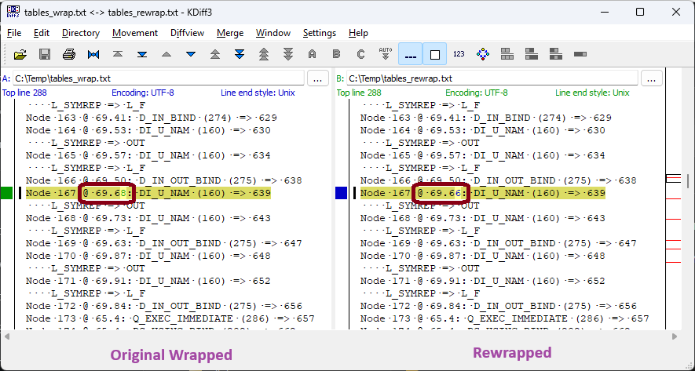

This means that the text at line 69, column 66 in the unwrapped source should really be at line 69, column 68 so we need to add two spaces before that text.  The following `L_SYMREP =>` line indicates that text will ***likely*** be `OUT`.

To get the right position, you may have to move earlier elements or even remove some optional elements.  Also, take care over any flow on effect for later elements.  In our case, you can see the next node (the `DI_U_NAM` of `L_F`) is already positioned correctly (@ 69.73) so we don't want that to move.  To accomplish this we needed to remove two spaces after the `OUT`.

#### *EQUIVALENT or MATCH Results*

These results probably indicate we reconstructed sub-clauses or keywords in a different, but semantically equivalent, order to the original.  Or we added an optional keyword that wasn't in the original (or vice versa).

These are a bit more difficult to identify than `EQUAL` results.  The first step though is the same except with some changes to the `DUMP_TABLES` parameters:
```
unwrapper.dump_tables (..., 'Y', 'NONE', 'NONE', 'INLINE', 'NONE')
```

> [!TIP] 
> When the parser processes a file it splits it into tokens and processes them in turn.  Often, when it reads a token it immediately creates a corresponding node (called a token node).
> 
> The `DUMP_TABLES` output shows all nodes created in the order they were created.  This gives us a (not perfect) mechanism to see the order these tokens appeared in the original source.
>  
>  Be aware, not all input tokens are created as nodes; notably many reserved keywords aren't.  This isn't a hard-and-fast rule though.  For example, for parameter declarations `IN` keywords are not created as token nodes but `OUT` and `NOCOPY` are (go figure).
> 
> Also, sometimes token-style nodes can appear in the parse tree that do not directly correspond to anything in the source.  This can happen when the parser has applied some transformation to the input.  For example, certain calls to `TRIM` are transformed to calls to `" SYS$STANDARD_TRIM"` (and, yes, there is a space at the start of that function).  In those cases, you will see the `TRIM` token node followed by, sometime later, a ` SYS$STANDARD_TRIM` node.

It is probably easiest to explain by example.  The below is a difference generated from our testing (which had a result of `EQUIVALENT`):
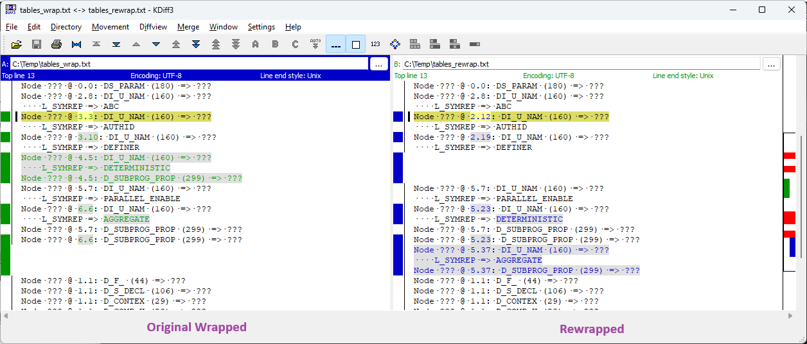

We can see the original source (the left side) must have had the following tokens, in order
- `AUTHID`, `DEFINER`, `DETERMINISTIC`, `PARALLEL_ENABLE` then `AGGREGATE`

For the unwrapped source (right side) it was
- `AUTHID`, `DEFINER`, `PARALLEL_ENABLE`, `DETERMINISTIC` then `AGGREGATE`

Immediately, we see the `PARALLEL_ENABLE` and `DETERMINISTIC` keywords are around the wrong way.  You need to edit the unwrapped source and switch those clauses around (in a syntactically valid manner).  At this point, don't worry about exact positioning just the order.  After making that change, rewrap the code and redo the verification.  This should given an `EQUAL` result; which can be fixed as detailed previously.

If we know about this why didn't we fix it?  Well, the actual `DETERMINISTIC` definition is a simple flag held on one of the `D_SUBPROG_PROP` nodes.  And we could find no reliable way of linking from that node to the corresponding `DETERMINISTIC` token/junk node to find its original position.

Another example generated from our testing is (this time a `MATCH`):
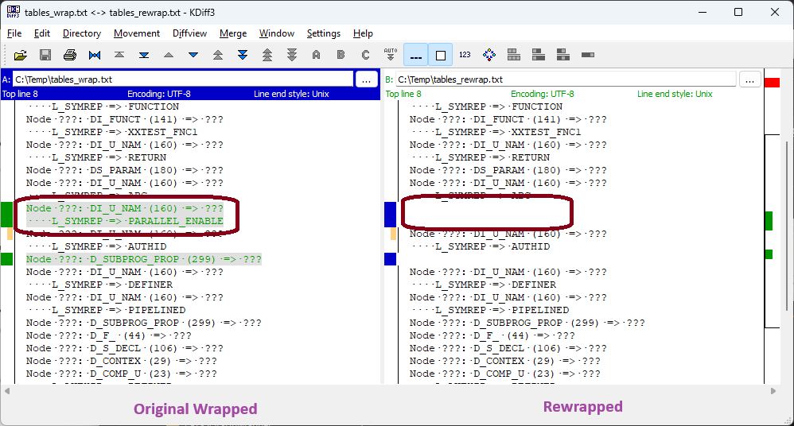

We can clearly see the original source (left side) has an extra `PARALLEL_ENABLE` token which isn't in the rewrapped source.  To fix, you would need to add a `PARALLEL_ENABLE` clause somewhere, syntactically correct, between the `ABC` and `AUTHID` tokens.

You might now be shouting at the monitor saying "you said this was a `MATCH` but those two trees are clearly not semantically the same, are you cheating us?".  Well, this is one of those invalid syntax cases discussed above.  The parser has determined the `PARALLEL_ENABLE` was not valid in that context / version so has removed it.  "Fixing" this may give you an `IDENTICAL` result but be aware if the PL/SQL you are using now accepts `PARALLEL_ENABLE` in this context then, technically, the fixed code will not be semantically equivalent to the original (but the unfixed code is).

#### *DIFFERENT or Leading Error Comment*

If the unwrapper has output source with a leading `--- Error: ...` comment or `WRAP_COMPARE` has returned a `DIFFERENT` result this indicates a problem with the unwrapper.  Likely, your code has a PL/SQL construct that we never encountered during our testing.

Really the unwrapper needs to be modified to support that construct.  However, there is a ***very slim*** chance that you may be able to identify the problem and fix the unwrapped code.

If you see a leading `--- Error: ...` comment, search for `{{`.  A description of the problem will be shown between the `{{` and following `}}`.  That text ***may*** give you some clues as to the issue.  Remove the `{{ ... }}` so that you get wrappable code then run a verification.  This should give a `DIFFERENT` result so you can follow the next step.

If you get a `DIFFERENT` result, compare the output from `unwrapper.dump_tree (..., 'N', 'N', 'N')`.  Hopefully, this shows only a few differences that will give you some clue to the difference.  In the unwrapped code, make what you think are appropriate changes to that area.  Then try the verification again.  Then rinse and repeat until you get a match (or, more likely, give up).

##### *Still Having No Joy?*

The above rules should help for many simple cases however there are quite a few situations that are just more complex than these rules can handle.

For those cases, it might be helpful to check out the full list of discrepancies we identified during  our testing.  See [here](#so-what-doesnt-work) for details, including some info on how to identify and rectify each situation.

> [!NOTE]
> Our test dataset included over 250,000 test sources; all but 134 returned a verification result of `IDENTICAL`.
> 
>We then ran an exercise to progress those 134 files to an `IDENTICAL` result.  To do so required a total of 177 edits to the unwrapped sources.  Of which we would categorise 113 as simple, 11 as a bit tricky, 49 as tricky and 4 as nigh-on-impossible.
> 
>*As they are very atypical of normal development, we excluded sources that defined 'C' language external call specs from this exercise.  They aren't actually difficult to fix but it can be very time consuming to do so given the number of possible sub-clauses (which can appear in any order).*

## The Bosses Want More?

So when you explained this to the boss they heard "identical" and they thought:

> *Brilliant, the original and rewrapped sources/files will be identical.  Even as a lowly incompetent boss I can understand that must mean the unwrapped source is (semantically) correct.*

And now you're having a hard time explaining you meant the DIANA tables (the parse tree) would be identical not the files.  Well, with a bit of text manipulation it should be possible to produce identical files.  And, although we don't consider this to be necessary, it surely gives a nice warm glow to the innards when you achieve this.

> [!NOTE]
> You can only get identical files/sources if `WRAP_COMPARE` first returns an `IDENTICAL` result.  If you have not managed that then there is no point in going forward here.

Some of the possible differences are pretty trivial and could be fixed using any decent text editor (by manual editing or global search/replaces).  But some are a bit more complex and not easy to perform via a text editor.  To help out, we have provided another utility, `NORMALISE`, that can be used to fix the possible issues we identified during our testing.

You call `NORMALISE` with some source and it will apply the fixes you specify via the parameters and return the fixed source.  You can then save that source to file or further process it as required.

*We recommend you only apply the fixes actually required for each file.  We also recommend you first backup any files that you intend to fix; even if those fixes are via a text editor or other utility.*

| Parameter        | Reason / Usage                                                                                                                                                                                                                                                                                                                                                                                                                                                                                                                                                                                                                                                                                                                                                                                                |
| ---------------- | ------------------------------------------------------------------------------------------------------------------------------------------------------------------------------------------------------------------------------------------------------------------------------------------------------------------------------------------------------------------------------------------------------------------------------------------------------------------------------------------------------------------------------------------------------------------------------------------------------------------------------------------------------------------------------------------------------------------------------------------------------------------------------------------------------------- |
| `p_trim_spaces`  | The wrapper produces quite a few lines with trailing spaces.  These are often stripped during later processing (e.g. when the source is loaded to the DB).<br><br>Setting this to `'Y'` will strip trailing spaces from the source.  <br>You would normally only need to apply this to rewrapped sources.                                                                                                                                                                                                                                                                                                                                                                                                                                                                                                     |
| `p_fix_create`   | The unwrapper always prefixes sources with `CREATE OR REPLACE` but this may not match the original source; which may use just `CREATE` or include extra spacing and even comments.<br><br>Setting this to `'Y'` ensures the source uses exactly `CREATE OR REPLACE`.<br>You would normally only need to apply this to original wrapped sources.                                                                                                                                                                                                                                                                                                                                                                                                                                                               |
| `p_fix_end`      | As far as we can discern, the wrapper always suffixes the wrapped output with a blank line followed by a `/` line.  However, this may no longer be the case for your sources, especially if you have extracted them from the DB.<br><br>Setting this to `'Y'` ensures the source ends with a blank line then a `/` line.<br>You would normally only need to apply this to original wrapped sources.                                                                                                                                                                                                                                                                                                                                                                                                           |
| `p_version`      | Wrapped sources include meta-data that indicates the PL/SQL version that performed the wrapping.  If you were unable to obtain the exact same DB version to rewrap the sources this version meta-data may differ.<br><br>If you provide a value for this parameter, the version number meta-data will be changed to that value.  This value must be 7 characters long consisting of digits and the `X` character.<br><br>*Note: This doesn't magically remove the prerequisite of first having an `IDENTICAL` verification result.  And, since you are rewrapping with a different DB version, this might not be possible (see [here](#cant-find-the-exact-db-version-for-rewrapping)).*                                                                                                                      |
| `p_line_endings` | If specified this will change the line endings used in the source.<br><br>Set to `UNWRAPPER.DOS` to force DOS line endings or `UNWRAPPER.UNIX` for Unix line endings.                                                                                                                                                                                                                                                                                                                                                                                                                                                                                                                                                                                                                                         |
| `p_fix_meta`     | All the above fixes are pretty simple and obvious.  However, there is one less obvious reason for differences.<br><br>The epilogue contains two meta-data tables.  We don't know exactly what they are used for but the first table seems to be dependent on certain external factors; not just the source being wrapped.<br><br>For example, under otherwise identical conditions we have seen this table change with small changes to the `WRAP` command line, by modifying environment variables or when the size of the source file passes certain thresholds.<br><br>Setting this to `'Y'` will replace all the values in the problematic meta-data table with zeros.<br><br>If you need to do this, you almost certainly will have to apply the fix to both the original wrapped and rewrapped sources. |

> [!NOTE]
>  Although it was not our original intention, most of these fixes can be applied to any valid source.  However, for somewhat obvious reasons, the `p_version` and `p_fix_meta` fixes can only be used on wrapped sources.
>
> Dependent on system and version, the line endings used in the rewrapped source may or may not be influenced by those in the unwrapped source.  If you prefer, you can control these by setting `unwrapper.g_line_endings` prior to unwrapping. 
> 
> This covers the differences we encountered during our testing.  However, we cannot guarantee you will not encounter other differences.  For reference, most of our unusual cases were due to comments in the `CREATE ... IS / AS` header or where the original wrapped source had undergone further post-processing (we had some cases where  comments had been stripped after the source was wrapped, and one case where comments had been added).

> [!NOTE]
> So far, our testing had managed to progress all 250,000 test cases to an `IDENTICAL` result from `WRAP_COMPARE`.  However, when examining the full source files we still showed differences in 243 sources.
> 
> A 99.9% rate, that's pretty good!  Still it'd be nice to push that to 100%.  So, we examined the actual differences and found they fell in to two categories; case differences and comments in the `CREATE` header plus changes in the meta-data table (discussed above in `p_fix_meta`).
> 
> So, first, for all the 243 different files, we ran the ***original wrapped*** source through `NORMALISE` to fix the `CREATE OR REPLACE` issue.  For example,
> - `unwrapper.clob2file (unwrapper.normalise (unwrapper.file2clob ('WRAP_DIR', 'FILENAME'), p_fix_create => 'Y'), 'WRAP_DIR', 'FILENAME');`
> 
> This cleared differences in 110 sources.  For the remaining 133 differences, we ran the ***original wrapped*** and the ***rewrapped*** sources through `NORMALISE` with `p_fix_meta => 'Y'`.
> 
> After that, all our sources were identical.  Woot!  Woot!
> 
> *We counsel you to not expect too much based on our results.  We had complete control over the conditions of the test process; including, extraction, wrapping, unwrapping and rewrapping.  You certainly will have less control, particularly over the original wrap process, and we expect this will lead to far more differences.  Hopefully though they will all be of a type discussed here or have obvious reasons / solutions.*

## PL/SQL (Database) Versions

To obtain best results from a verification you need to rewrap the unwrapped code using the same PL/SQL version that originally wrapped the code.

PL/SQL versions match the database version that introduced that version of the PL/SQL grammar.  For example, there were no changes to PL/SQL between 8.0.3 and 8.0.5, so both 8.0.3 and 8.0.5 use PL/SQL version 8.0.3.

How do you know what DB version(s) you need?  Well the version number is encoded in the wrap prologue.  It is a 7-digit number on a line by itself about 20 lines after the `wrapped` keyword.  The number ABBCCDD refers to version A.BB.CC.DD, so 8.0.3 is encoded as 8003000.

You can use many tools to access this.  For example, in our GNU Linux we can find the count of files wrapped under different versions using something like:
```
grep -r -h -o -z -P -e '[[:space:]]wrapped *\r?\n0 *\r?\n(.*\r?\n){10,25}[0-9]{7} *\r?\n' . | grep -a -o -P -e  '^[0-9]{7}' | sort | uniq --count
```

The `UNWRAPPER` package also has a utility, `GET_VERSION`, that can return this for you.  This may be useful if you want to do some programmatic actions on these files.  For example, segregating them into separate directories based on version.

OK, now you know what version(s) you need how can you obtain them?  Well, you obviously had these versions at some point so you may have these available in your software archive.  If not then if you have a license for any Oracle DB version you can obtain old versions from Oracle support as detailed in:
> [1071023.1 – How to Request Software Media when it is Unavailable on the Oracle Software Delivery Cloud Site](https://support.oracle.com/epmos/faces/DocumentDisplay?id=1071023.1)

If you don't have a licence then there are some installs available on the web.  But the options are pretty sparse.

> [!TIP]
> Dependent on the exact version you require, you may need to download a base release then apply necessary patchsets to upgrade the DB to the required version.  All patchsets for all versions should be available from My Oracle Support.

## Can't Find The Exact DB Version For Rewrapping?

Well, things certainly get more difficult but all ***may*** not be lost.  Probably the best option is to rewrap with the closest version you can obtain that is later than the required version.

> [!WARNING]
> Major changes were introduced to PL/SQL in 9.2.  If you have pre-9.2 wrapped code it might be better using the closest older version you can obtain to perform the rewrap in preference to using 9.2.  Provided the older version supports your source this should give better results. 

What are the effects of rewrapping using a different version?  Well, this depends on your code and the changes introduced to PL/SQL between the two versions.

- New node types may have been added.  These represent new functionality and, since your code won't use that functionality, they will not affect the verification result.

- New attributes may have been added to existing node types.  Likely this will result in changes to the *Attributes* and *Attribute Refs* DIANA tables meaning the best result you can hope for is `EQUIVALENT`.  That said, if your code doesn't use the changed node types you may still see `IDENTICAL` and `EQUAL` results.

- Oracle may have changed how the parser operates.  In these cases, the same construct may start generating different parse trees between the versions.  In these situations you will get a `DIFFERENT` result.
  
  The best you can do here is to use `unwrapper.dump_tree (..., 'N', 'N', 'N')` to dump the parse trees for the original wrapped and rewrapped sources to file.  Then diff those files and make a decision as to whether those trees represent the same code.

The upshot?  If rewrapping with a different DB version you have to accept that `IDENTICAL` may not be possible and `EQUAL`, `EQUIVALENT` or `MATCH` all indicate correctness.  Even `DIFFERENT` can be a valid result (but may warrant further investigation).

The situations we encountered where the unwrapped code was correct but we got a `DIFFERENT` result due to different DB versions are shown below.

In 8.1, Oracle introduced the `TRIM` built-in.  Built-ins are parsed differently to user functions so the code `trim (v_surname)` in 8.0 and 8.1 produce different parse trees.
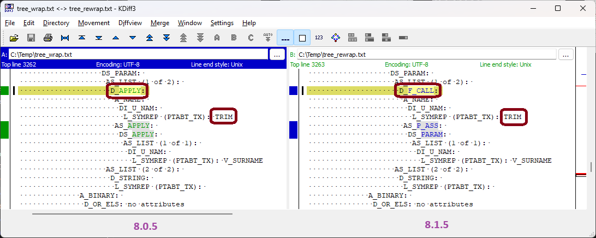

In 8.0, `RESTRICT_REFERENCES` pragmas were referenced twice, once from the owning function and once where they appeared in the source.  From 8.1, Oracle deprecated `RESTRICT_REFERENCES` and, as part of that move, removed the ***extra*** reference from the owning function (the `SS_PRAGM_L` attribute).
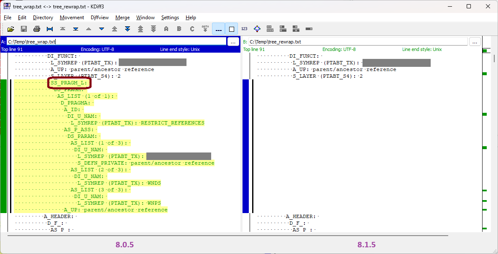

In 8.0, Oracle flagged `CAST (MULTISET (SELECT ...))` operations with an `L_DEFAULT` value of `8` against the `Q_EXP` node (which represents the `SELECT` statement).  In 8.1, this changed to `16`.  This only applies to `Q_EXP` nodes with a grandparent `D_CONVER` node (a `CAST` operation).
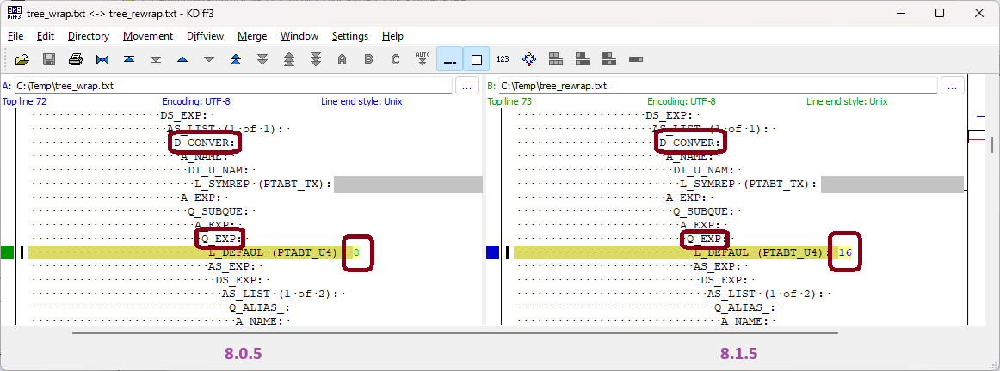

In 8.1.5, Oracle introduced `LEADING`, `TRAILING` and `BOTH` clauses for the `TRIM` function.  A subsequent small change (in 8.1.6) changed how simple `TRIM` calls were parsed.  So, the code `trim (' abc ')` is parsed differently between 8.1.5 and 8.1.6.  *The observant may notice this actually reverses the change made when `TRIM` was first introduced in 8.0 (see first above).*
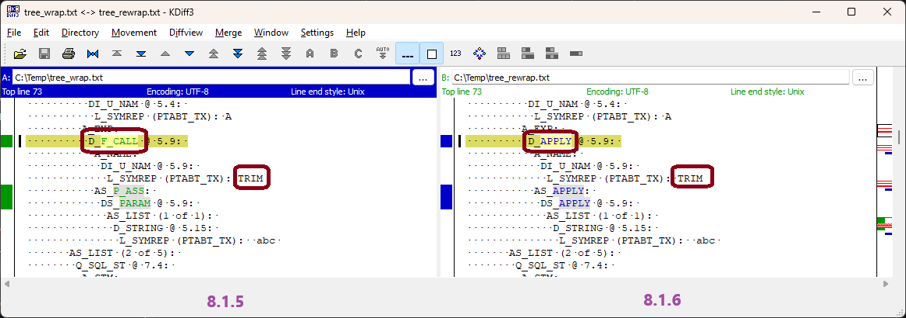

When Oracle introduced `LEADING`, `TRAILING` and `BOTH` support for `TRIM` they bodged it a bit and simply transformed those into equivalent `RTRIM` and `LTRIM` calls.  From 9.0, Oracle introduced better native support; transforming these to calls to an internal ` SYS$STANDARD_TRIM` function.  So the snippets `trim (leading 'x' from 'xabcx')`, `trim (trailing 'x' from 'xabcx')` and `trim (both 'x' from 'xabcx')` are parsed differently between 8.1.5 and 9.0.
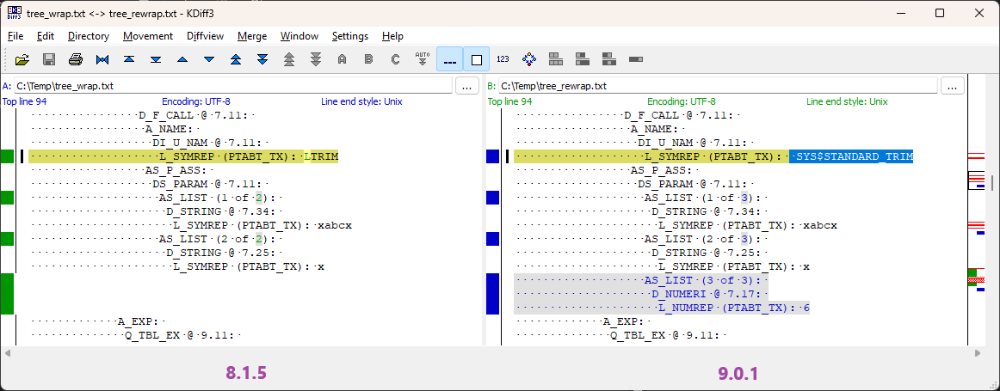
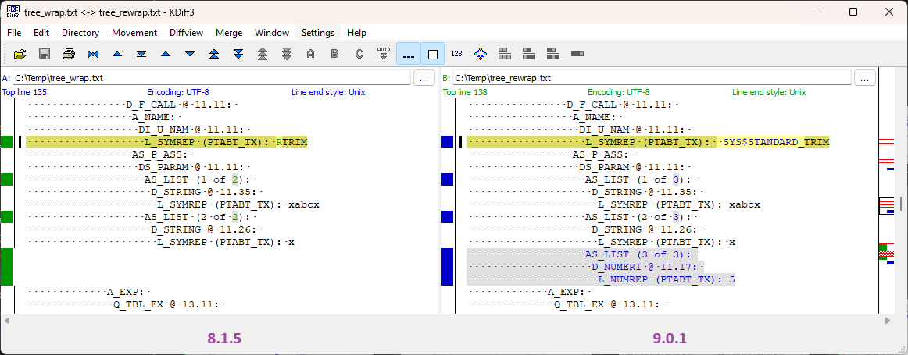
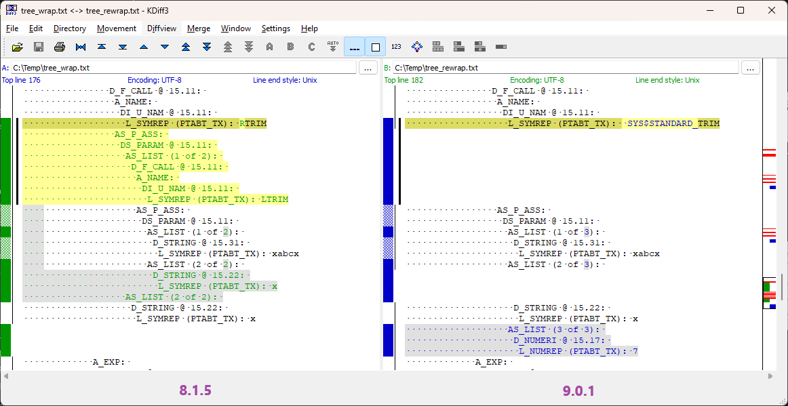

Oracle transforms many PL/SQL constructs to simplify them for later processing.  From 9.0, Oracle sometimes flags when a transformation has been applied by setting `L_DEFAUL` to `64` or `128` on the name element of the transformed tree.  For example, the `rollback` statement is transformed to a `rollback_nr` procedure call.  These generate slightly different trees between 8.1.5 and 9.0.
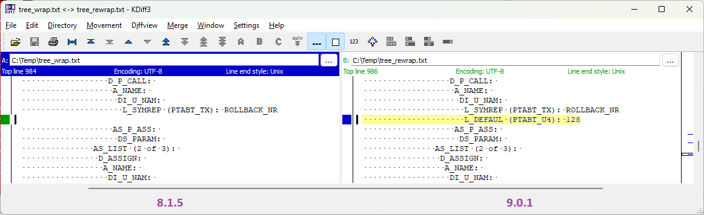

In 8.0 and 8.1, Oracle always stripped the first character in a hint comment.  And, yes, if your hint text did not start with a space that could very well mean the hint was ignored.  Starting from 9.0, Oracle stopped this decidedly odd behaviour.  So the comment `/*+hint_text */` is parsed differently between 8.1.5 and 9.0.
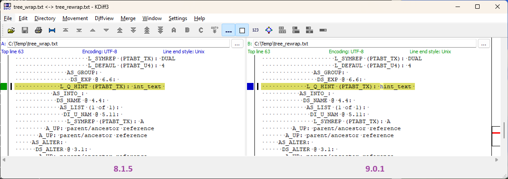

In 9.2, Oracle slightly changed how they parsed INDEX BY tables.  Previously, they sometimes used a simple node for the index type and sometimes a constrained type (`D_CONSTR`) node.  Starting from 9.2, they always use the constrained type version even if the index type itself is simple.
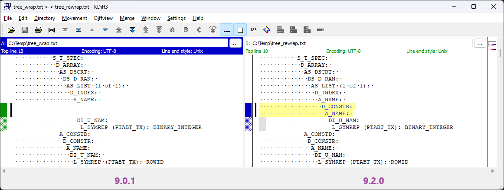

However, by far the biggest change in the upgrade from 9.0 to 9.2 was how Oracle handled SQL statements.  Previously, Oracle stored a parse tree representation of the statement.  This caused lots of problems, not just with keeping PL/SQL up-to-date with SQL but also in use of newer features (e.g. cursor sharing).  So, starting from 9.2, Oracle simply stores the text of the SQL statement rather than the parse tree.

Probably the simplest example of this is `commit`, as shown below.  Other examples get a lot more complex quickly.  However, in general, you should be able to get a feel that the old and new trees represent the same SQL statement.
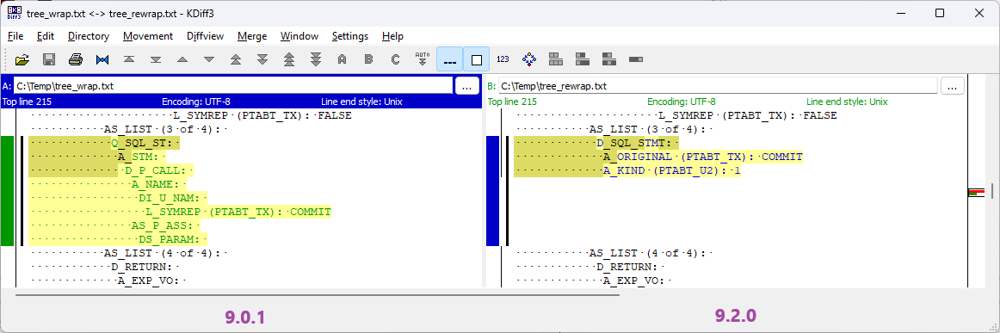

## Double Wrapping

Most people think the `WRAP` utility takes PL/SQL source and generates wrapped output.  However, it has another trick up its sleeves.  Taking existing wrapped output and "upgrading" it to match the grammar for a later PL/SQL version.

Unfortunately, this is another source of headaches for us as, although the result is compatible with the new grammar, it is not the same as if the source was wrapped under that version.

- During an upgrade, all `WRAP` does is go through the node table, identifying nodes that have had attributes added in the new grammar.  It makes space for the extra attributes by moving that node's attributes to the end of the *Attributes* table; copying any existing attributes and setting new attributes to zero.
  
  However, under normal operation, `WRAP` creates attributes in node order.  So the *Attributes* and *Attributes Ref* table will be different after double wrapping as compared to a normal wrap.  Different DIANA tables mean no chance of an `IDENTICAL` comparison result.
  
- The code is still wrapped with the "quirks" of the version that originally wrapped the source; not the upgraded version.
  
  For example, referencing the first example in the previous topic, if originally wrapped in 8.0.5 then double wrapped to 8.1.5, code like `trim (v_surname)` would still use a `D_APPLY` node, as used in 8.0.5, rather the `D_F_CALL` node used in 8.1.5.
  
- The meta-data in the double wrapped code shows the later PL/SQL version not the one that originally wrapped the code.  We have found no reliable way of identifying if code has been double wrapped or what version did the original wrap.

The only reliable verification mechanism would be to determine the cycle of wraps issued on the original source and to mimic them on the unwrapped source.  You may have this squirrelled away in some documentation but we know of no way of determining this from the code.

However, you can still attempt verification using the upgraded PL/SQL version.  But you will need to treat it as a [verification with a different DB version](#cant-find-the-exact-db-version-for-rewrapping) with the added niggle that you won't know this at the start nor what the original DB version was.

> [!NOTE]
> Some of our code is dependent on knowing the PL/SQL version that wrapped the code.  Double wrapping can throw this off as we assume the quirks of the later version.
> 
> However, at no point will we generate non-semantically equivalent code.  It just may not be as close to the original source as would be generated if we knew the original PL/SQL version.

## Virtual Machines (for Windows)

For any verification, you will likely have to install one or more very old versions of Oracle on some very old operating systems.  For our testing, the Oracle software we used was all Windows based; some requiring Windows 95, some Windows 98 and some Windows NT.

Like us, you will probably want to run these as a virtual machine.  We tried both obvious free VMs, Virtual Box and VMWare, and, for these really old versions of Windows, found VMWare was slightly better and more reliable than VirtualBox.

However, we didn't consider either an acceptable option (especially if you, like us, have Ryzen processors).  Not only was installation a bit of a kerfuffle but it was hard to share files and we experienced frequent crashes and hangs.

At some point, this all got too much for us so we decided to force install these DBs on Windows XP.  Both VMWare and VirtualBox are much better at handling XP; especially for sharing files.  It also meant we could switch back to using VirtualBox (we really don't like the VMWare UI).

Windows NT should install as is on Windows XP.  To install Windows 95 or 98 software requires a little tweak.  First, copy the install files to a temporary folder.  Find all `SETUP.EXE` programs (there will be multiple).  Right click on each -> Properties -> Compatibility.  Tick *Run this program in compatibility mode for:* then select *Windows 95* or *Windows 98* as appropriate.  You then run the `SETUP.EXE` from the the temporary folder.

The only issue we encountered with this scheme was the client occasionally crashing during bulk operations on the host on a folder shared to the client.  However, this was pretty rare, nothing was lost and we could just restart the VM.

> [!TIP]
> The only reason to install these old DB versions is to get access to the `WRAP` program.  This should be available with a minimal install.  There is no need to install or create a database.
> 
> We wouldn't recommend this sort of force install if you actually wanted to run a DB.

## Our Testing

Our testing was quite comprehensive and included:
- All the source from system schemas from Oracle 18c (including an Apex install).
- All the source from a small Oracle-based enterprise system.
- All the source from a large Oracle-based enterprise system.
- A number of extra tests created to test specific functionality.

In total, this comprised around 2 GB of source, 100,000 files and 35,000,000 lines of code.

We wrapped all files under 8.0.5, 8.1.5 and 9.0.1 then unwrapped them.  The unwrapped files were rewrapped and the two sets compared using `WRAP_COMPARE` with the results below.

| Version | Wrappable Sources | `IDENTICAL` | `EQUAL` | `EQUIVALENT` | `MATCH` | `DIFFERENT` |
| :-----: | ----------------: | ----------: | ------: | -----------: | ------: | ----------: |
|  8.0.5  |             84778 |       84666 |      54 |            4 |      54 |           0 |
|  8.1.5  |             89908 |       89649 |     140 |           33 |      86 |           0 |
|  9.0.1  |             91908 |       91513 |     246 |           33 |     116 |           0 |

> [!NOTE]
> Our test sources were all quite recent and some used functionality not available in 8 / 8i / 9i.  So not all 100,000 sources could be wrapped under each version (the actual number that could is shown in *Wrappable Sources* above).  We were quite surprised though to see how many newish sources were still compatible with decades old versions of PL/SQL. 

We think those results look pretty good.  However, as mentioned earlier, a number of the 18c system sources used 'C' language external call specs.  These are very atypical of normal PL/SQL development.  If we exclude those sources (around 300 all up) we get even better results.

| Version | Wrappable Sources | `IDENTICAL` | `EQUAL` | `EQUIVALENT` | `MATCH` | `DIFFERENT` |
| :-----: | ----------------: | ----------: | ------: | -----------: | ------: | ----------: |
|  8.0.5  |             84676 |       84665 |      10 |            0 |       1 |           0 |
|  8.1.5  |             89684 |       89648 |      32 |            3 |       1 |           0 |
|  9.0.1  |             91598 |       91512 |      76 |            2 |       8 |           0 |

We believe these results demonstrate that ***all*** the unwrapped code is semantically equivalent to the original source.

However, being pedants, this was not good enough for us, so we undertook an exercise to progress the 133 non-`IDENTICAL` sources to an `IDENTICAL` result.  This was successful, requiring around 180 edits to the unwrapped code (see [here](#but-what-if-the-bosses-will-only-accept-an-identical-result) for details).

Our pedantry kicked in again, so we went on to compare the ***full*** sources/files using a `diff`-style utility.  We were super surprised that all but 243 files were identical.  We never expected that level of exactness!  We also found that it only required a few simple text edits for all files to be identical (see [here](#the-bosses-want-more) for details).

At this point, we determined we couldn't get better results.  So we patted ourselves on the back and went out for a beer (or two).

> [!NOTE]
> We performed most development and testing from a 21.3 database.  However, we also ran a reasonable subset of test cases under 10.2, 12.2, 18.3 and 23.6 (all of which were successful).

## So What Doesn't Work?

Well, in our opinion, nothing.  We believe every one of our test cases was a success; that is the unwrapped code was *semantically* equivalent to the original source.

However, we get better comparison results if the unwrapped source is *syntactically* as close as possible to the original source.  We put a lot of effort into achieving this and, largely, succeeded.  But there are some areas where we couldn't achieve our gold standard of `IDENTICAL`.

> [!WARNING]
> Old PL/SQL parsers had certain quirks and bugs that were subsequently fixed in later versions.  Sometimes this means achieving an `IDENTICAL` comparison ends up with code that, under a newer DB version, cannot be compiled or is not semantically equivalent to the original.  For more information see [here](#invalid-stuff). 

##### *Easy Stuff*

Many non-`IDENTICAL` results are simply because we did not reconstruct certain keywords or sub-clauses in their original orders or positions.  Often, this is because the keyword or sub-clause is transformed to a simple flag or isn't directly referenced when traversing the parse tree; making it difficult to determine their original positions.

Generally, these cases are relatively simple to fix using the rules described [here](#but-what-if-the-bosses-will-only-accept-an-identical-result).  The specific instances we saw in our testing were:
- the ordering and positioning of sub-clauses in 'C' language external call specs - these can be quite tricky to get right purely due to the number of possible sub-clauses
- the ordering and positioning of `AUTHID`, `PIPELINED`, `DETERMINISTIC`, `PARALLEL_ENABLE` and `AGGREGATE` keywords in a function declaration
- in clauses with multiple keywords, the positioning of secondary keywords; for example
	- `interval day(x) to second(y)`
	- `timestamp with time zone`
	- `using in out`
	- `interval 'x' year to month`
	- `interval 'y' day to second`
	- `ref cursor`
	- `timestamp at time zone tz` 
- the position of `BULK COLLECT INTO` (or one of the secondary keywords)
- the position of `ELSE` in an `ELSE NULL;` sub-clause of a `CASE` expression
- the position of `PARTITION` in a `FROM table PARTITION (x)`
- the position of a `)` that immediately follows the `END` for a `CASE` expression
- we always add a space between a number and any following (non-operator) keyword; so we reconstruct `if 2 > 1then` as `if 2 > 1 then`
	- we accept this is a limitation of our code and could be fixed.  but it is rare and our code that handles spacing is already very complex and we don't want to poke the bear just to make changes to support (what we consider) poor coding.

##### *Trickier Stuff*

There are a number of other situations that involving a bit more investigation to identify and fix and may require the use of `DUMP_TREE` and/or `DUMP_TABLES`.  If so we have indicated which to use along with the most appropriate parameters.

- If a SQL statement has a sub-query wrapped in two sets of brackets, the parser automatically removes the first, extraneous, set of brackets.  However, in some situations, one of the nodes it creates still reflects the position of the first, removed, set of brackets.
  
  To identify: If a `DUMP_TREE (..., 'N', 'Y')` output shows a `Q_TBL_EX` node whose ***first*** grandchild is a `Q_SUBQUE` node and the two nodes have different positions it indicates the sub-query was double bracketed.  The `Q_TBL_EX` node holds the position of the first set of brackets, the `Q_SUBQUE` that of the second.
  
  For example, `select a into n from ( ( select 1 a from dual ) );` will be unwrapped as `SELECT A INTO N FROM   ( SELECT 1 A FROM DUAL);` with the below parse trees:
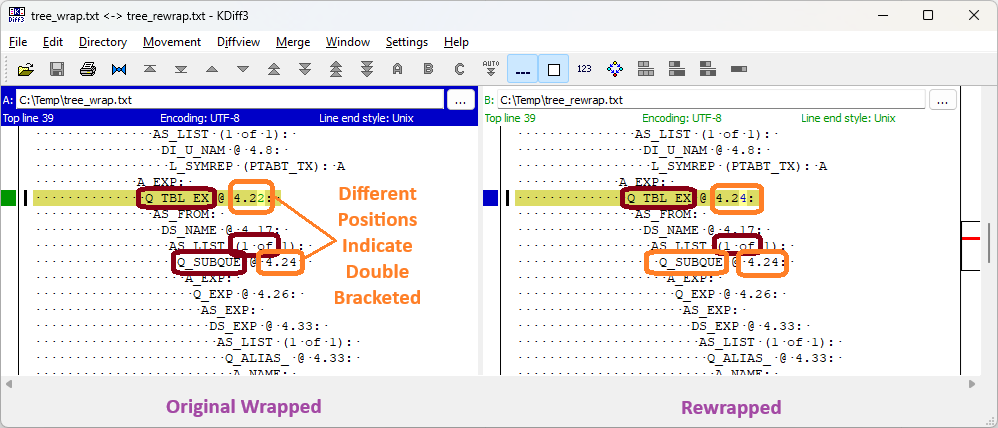

- In 8 and 8i, when we reconstruct a program unit definition it is important to use the same `IS` or `AS` separator as was used in the original source.  There is no definitive way of knowing this but we have implemented logic to guess at this.  It's pretty good but not infallible.  ***This does not apply if the code was originally wrapped in 9i.***
  
  To identify: If you compare `DUMP_TREE (...)` output and see a difference in the node ids close to a `D_P_BODY`, `D_P_DECL` or `D_S_BODY` node then you may want to switch the `IS` / `AS` separator used for that program unit and try again.  The specific differences vary but often include a `D_F_` or `D_P_` node referenced from the `A_HEADER` attribute.
  
  For example, one of our tests reconstructed `function read return long raw as` as `FUNCTION READ RETURN LONG RAW IS`.  The differences in trees was:
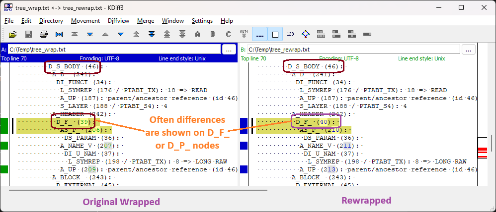

- PL/SQL allows you to put labels after any `END` statement; including those for program units, embedded blocks and `IF`, `CASE` and `LOOP` statements.
  
  For program units, these labels must match the program unit name giving us a reliable mechanism to identify and reconstruct them.  For the other cases, you can chuck any old gobbledygook in there so we have no chance of reliably reconstructing them, so we don't.  *We have even seen a case where an `END` had a `COMMIT` label, obviously this was intended as a statement but the dev missed the `;` between the `END` and `COMMIT`.*
  
  To identify:  Compare the output from `DUMP_TABLES (..., 'Y', 'INLINE', 'INLINE', 'INLINE', 'INLINE')`.  If you see an extra `DI_U_NAM` node in the original source and the position of that node places it between an `END`, `END IF`, `END CASE` or `END LOOP` and the following piece of code then it is likely a label for that end.  *This is based on the @ positions not node order - nodes are often created out-of-order so don't always reflect their ordering in the code.*
  
  For example, one of our tests included `end case error_handler;`.  We unwrapped this simply as `end case;` positioned at line 530, column 11 with the next statement starting at line 532, column 11.  In the dump below, you can see the original file has a reference to an extra `error_handler` token at line 531, column 20.  This is between the `end case` and the following statement so indicates that that token was likely a label for the `end case`.
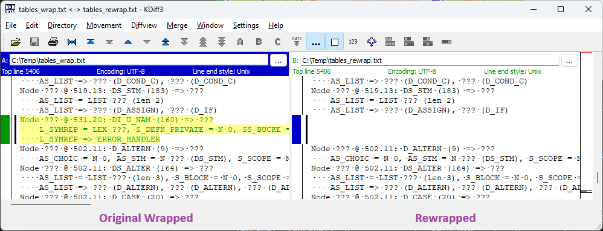

- In general, the wrapper sanitises the input source by uppercasing it and removing comments.  However, it does not sanitise the text for the `CREATE` header.  That is, everything in the original source from the initial `CREATE` to the program unit name is copied as is, including spacing, upper/lowercasing and comments.
  
  To improve comparisons between the source files (not parse trees), the unwrapper extracts this section of the code from the "normal" source of the wrapped code not from the parse tree.  This really helped in our tests raising the number of identical files from about 50% to 99%.
  
  Theoretically, this could lead to issues if someone or something edited the source after it was wrapped and changed that header.  Most obviously would be to add or remove comments or extra spacing.
  
  This should lead to an `EQUAL` result that can be remedied following the steps [here](#equal-results).  If stuff had been removed it should be easy as only the program unit type and name will be affected.  If stuff had been added it will affect all tokens that were in the extra space added.  So if a 20-line comment was added all the tokens in the first 20 lines of unwrapped code might be affected.

- The trailing `;` for a `CREATE TYPE` statement is optional and its presence or absence and positioning affects the wrapped output in some weird and wonderful ways.  We have logic to determine if and where this character appeared but it may not be 100% accurate (it works for our test cases but our test systems don't have huge numbers of types).

- We have quite a few issues with `CREATE TYPE` statements that include `ALTER TYPE` sub-clauses.  These are likely going to be tricky to identify and fix.  However, the only real-world cases we saw were for the first issue mentioned below.  The others issues were only identified through artificial test cases.
  
  The documentation (if you can find it), indicates `ALTER TYPE` sub-clauses start `ALTER TYPE type_name`.  However, `type_name` does not have to be the actual type name, you can put any identifier you want here.   We always output the actual type name and often get the position wrong.  So if we are creating type `abc`, the sub-clause ```alter type     xyz final``` would be reconstructed as `alter type abc     final`.

  The parser strips the `FINAL`/`NOT FINAL`/`INSTANTIABLE`/`NOT INSTANTIABLE` settings from the initial definition and all `ALTER TYPE` sub-clauses.  It works out the overall effect and sets the results as simple final and instantiable flags.  We always reconstruct those flags in the initial definition.  So `create type abc ... final alter type xyz not final` would be reconstructed as `create type abc ... not final alter type abc`.

  We cannot reconstruct complex dependent handling clauses.  We have some logic to handle the simple `CASCADE` and `INVALIDATE` cases but nothing more complex.  However, the reason we can't reconstruct these is because they don't appear in the parse tree.  Indicating they have no semantic relevance when used within wrapped code - possibly they are compile-time only options?

  We also know that the parser can reverse the order of attributes in an `ALTER TYPE abc DROP ATTRIBUTE` sub-clause.  Why?  We don't have the foggiest idea.  But we will output these in the wrong order.

- Our main testing started with proper source which we wrapped, unwrapped, rewrapped and verified.  This made it much easier to work out what elements weren't being reconstructed correctly and how to fix any issues.  However, for completeness, we also performed some testing on code that was already wrapped (around 3000 sources all up).
  
  We encountered one strange situation with that testing where the unwrapper generated seemingly unnecessary `NULL` statements; adding them at the end of embedded blocks and exception handlers.  Given their positioning we were positive that these statements were not in the original source.  But an investigation showed that they were indeed in the parse tree - they weren't hallucinations of the unwrapper.
  
  However, that investigation also indicated the sources involved had been involved in [double wrapping](#double-wrapping).  Our best explanation is that the version 7 `WRAP` used to automatically add these statements but Oracle stopped that practice starting from version 8.  And these sources had been originally wrapped in version 7 then double wrapped to 8.1.6.
  
  This isn't as far fetched as it might seem as there are other situations the wrapper does stuff like this.  For example, if you omit the `ELSE` clause from a `CASE` statement the parser automatically adds `ELSE RAISE CASE_NOT_FOUND;`.  For `CASE` expressions with no `ELSE` it adds `ELSE NULL`.
  
  Also, examination of code truly wrapped in 8 / 8i / 9i showed these versions still exhibit vestiges of this behaviour; nodes for those `NULL` statements are still being created they just end up being junked (i.e. don't get referenced anywhere in the parse tree).
  
  We actually have enough information to identify these cases so we could stop outputting those extra statements.  But if we did this any verification done in 8, 8i or 9i would produce a `DIFFERENT` result.  The only way of getting reliable verification would to be rewrap under DB version 7 (then double wrapping it as needed).  And that is not something we are supporting here.
  
  To identify:  Compare the outputs from `DUMP_TREE (..., 'N', 'Y', 'Y')`.  This situation is indicated if the original wrapped source has a `D_NULL_S` (null statement) node that is the ***last*** element in a `DS_STM` list that has at least two elements and the `D_NULL_S` does not have a child `A_UP` attribute.  However, there is nothing really that can "fix" this situation.
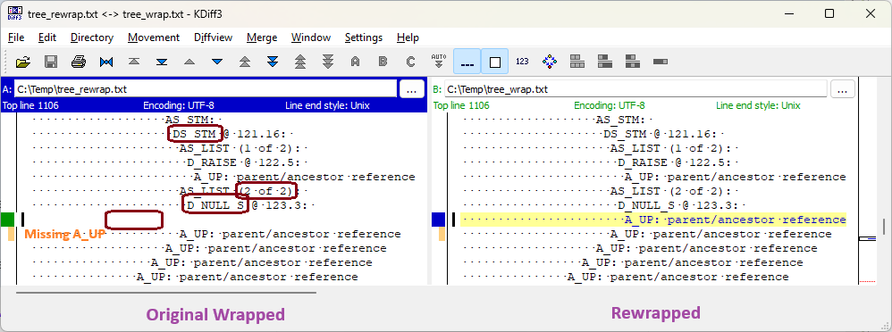

##### *Invalid Stuff*

In our testing, we encountered cases where the original source included some form of invalid syntax that the parser ignored or transformed into valid code.  When we unwrap that code we reconstruct the transformed / sanitised code.  After all, that is the code that is actually being run.

In these cases, you will almost certainly get a non-`IDENTICAL` verification result.  If you must get an `IDENTICAL` result you can follow the points below.  But, if you do, be aware that the resultant code may no longer compile or, in the `count` case, compile but generate run-time errors (or, in the most extreme case, invalid results).

- In a function declaration, the parser sometimes ignores `PIPELINED`, `AGGREGATE`, `DETERMINISTIC` and `PARALLEL_ENABLE` clauses that appear ***before*** an `AUTHID` clause.  These don't end up in the parse tree so we can't reconstruct them.
  
  *Note: Syntax diagrams from 9.2 show that `PARALLEL_ENABLE` and `DETERMINISTIC` should be valid before an `AUTHID` clause.  So it might be that some aspects of this are version specific or dependent on some other context.*
  
  To identify: Compare the output of `DUMP_TABLES (..., 'Y', 'INLINE', 'INLINE', 'INLINE', 'INLINE')`.  This situation is indicated if the original wrapped source has extra `DI_U_NAM` nodes with a `L_SYMREP` of one of these keywords.
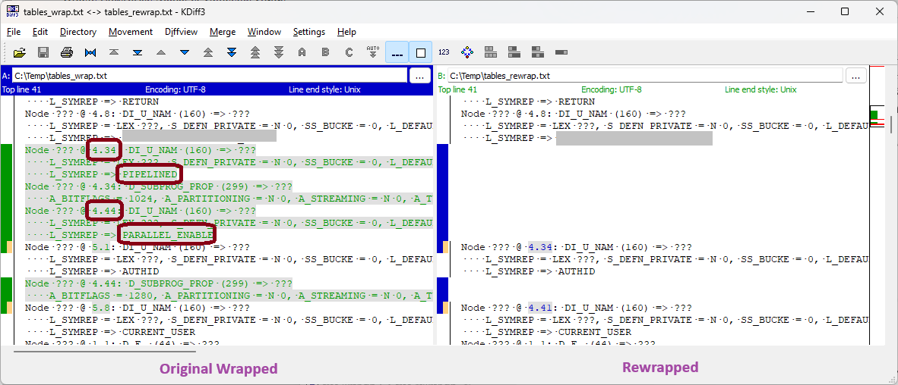

- To declare a program unit as autonomous you add `PRAGMA AUTONOMOUS_TRANSACTION;` anywhere in the declarative section of the program unit (between the `FUNCTION` / `PROCEDURE` / `DECLARE` and the first `BEGIN`).  Any use of that pragma outside that section is ignored (e.g. if it is in the actual code block).
  
  To identify: Compare the output of `DUMP_TABLES (..., 'Y', 'INLINE', 'INLINE', 'INLINE', 'INLINE')`.  This situation is indicated if the original wrapped source has extra `DI_U_NAM` nodes with `L_SYMREP` of `PRAGMA` and `AUTONOMOUS_TRANSACTION`.  You will likely also see an extra `D_PRAGMA` node that the parser created before determining the position was invalid (at which time it junked the `D_PRAGMA` node).
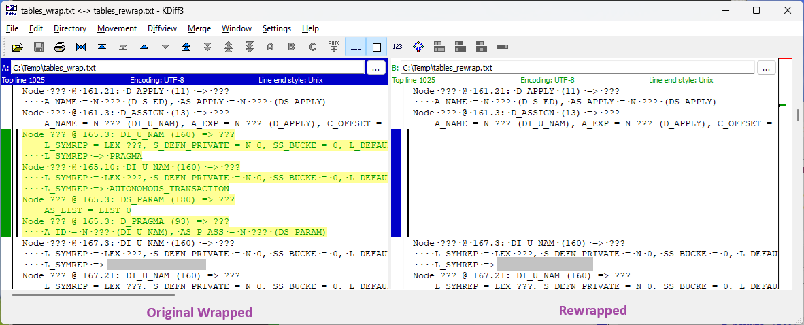

- Although we can't remember it ever being valid, older versions of PL/SQL treated `count` to be the same as `count(*)`.  This is no longer allowed so we reconstruct these as `count(*)`.
  
  For example, the code shown below will wrap in 8 / 8i / 9i and if the wrapped code is loaded to a DB and run it will output `1` (even from current DBs).  To represent this, our unwrapper will output this as `select count(*) into ...`.
  
  But, the extra `(*)` might affect the position of later tokens on the line so the unwrapped code may generate an `EQUAL` verification result.  To get an `IDENTICAL` you would need to "fix" it  back to `select count into ...`.
  
  But that code in later DBs is not semantically equivalent to the original (as it will output `2`).  More likely though, this sort of "fix" will result in an invalid SQL statement; and that error will only come to light at run-time.
  
  To identify: This situation is indicated if verification showed position differences in nodes that followed on the same line as `count(*)` and those differences can only be rectified by removing the `(*)`.
```
create or replace procedure p as
   n  number;
begin
   select count into n from ( select 2 count from dual );
   dbms_output.put_line (n);
end;
```

- We had one further odd issue where a single SQL statement had two hint comments; it looked a bit like `SELECT /*+ ... */ /*+ ... */`.  For unknown reasons, the parser only applied the second hint to that SQL statement.  Even stranger, it applied the first hint to the next SQL statement that it found in the package (which was in a different function).
  
  The unwrapper matches the semantics of the wrapped code so it output the second hint on the first SQL statement and the first hint on the second statement.  If you, somehow, identified and fixed this, so both hints were on the first SQL, then you will have generated semantically different code (unless newer PL/SQL versions still have this bug).

  To identify: This one is tricky.  We were only able to do so as we had the original (not wrapped) source.  Maybe the knowledge that this is theoretically possible will help you?

# Final Thoughts

The above discussion might seem quite daunting.  But, don't worry, things aren't as bad as they may first appear.

Firstly, nearly all of this analysis relates to verifying the unwrapped source.  And, as noted at the start, you only have to perform as much verification as you are comfortable with.  The bulk of this readme only becomes truly relevant if you've decided that nothing short of `IDENTICAL` verification results or byte identical files will let you sleep soundly at night.

Secondly, although we've discussed quite a few issues we only encountered a few instances of each.  In total, we only had around 400 issues over 35,000,000 lines of code.

Thirdly, many issues are simply positioning or ordering and are simple to identify and fix (for a human at least, not so for a non-AI bit of code).

Fourthly, the issues that are trickier to fix tend to be related to new(-ish) PL/SQL features.  And, in our opinion, your code is not that likely to have used those features given that it was basically deprecated by 9.2 (or earlier).  The only reason we saw a reasonably amount of these is that our test sources are still under active development.
